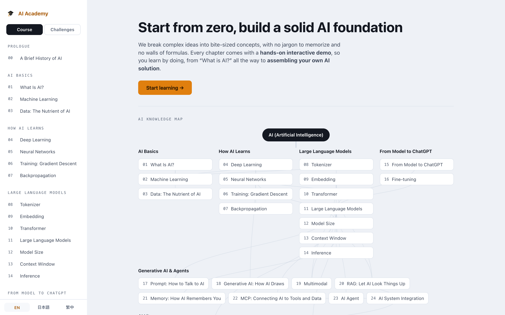

# Awesome AI Learning

> Understand AI from scratch, for real.



An interactive AI learning platform: no coding background needed, just open it and start. Each chapter focuses on one core idea and pairs it with a hands-on interactive demo, so you learn by doing, from the basic principles of AI all the way to assembling your own AI application. The interface and all the material come in **English, 日本語 and 繁體中文**, switchable anytime.

## Features

- **Learn by doing**: every chapter has an interactive demo. You grasp the idea by operating it, with no jargon to memorize and no formulas to fear.
- **Step by step**: a prologue plus six chapters, 28 lessons that build naturally on one another.
- **Ask Professor AI anytime**: a built-in offline knowledge-base tutor. Ask questions as you learn so you never get stuck (fully offline, no external model calls).
- **Easy to review**: each chapter comes with a summary, key terms and further reading.
- **Trilingual**: English, 日本語, 繁體中文. Switching language switches the material too.

## Course map

**Prologue** · A brief history of AI

- **① AI foundations**: What is AI → Machine learning → Data (the fuel of AI)
- **② How AI learns**: Deep learning → Neural networks → Training (gradient descent) → Backpropagation
- **③ Large language models (LLM)**: Tokenizer → Embedding → Transformer → Large language models → Model size → Context window → Inference
- **④ From model to ChatGPT**: From model to ChatGPT → Fine-tuning
- **⑤ Generative AI and AI agents**: Prompt → Generative AI → Multimodal → RAG → Memory → MCP → AI agent → System integration
- **⑥ AI literacy**: The limits of AI → Evaluation → What you can do with AI

Beyond the course, a **Challenges** mode collects advanced interview-style questions across principles, training, inference, prompting, retrieval, agents, generative models, literacy and system design, each with a think-then-reveal answer.

## Getting started

Open the site and hit **"Start learning"** to enter the first lesson, or pick any chapter from the course map. Follow the interactive demos step by step, and ask Professor AI whenever you get stuck.

The goal is for you to truly **understand** AI, not just learn to use it.

## Tech

Built with Vite 6 and Svelte 5. Fully frontend, zero backend, no runtime LLM: the tutor answers from a local knowledge base, so everything works offline.

```bash
npm install
npm run dev      # local development
npm run build    # production build to dist/
npm run preview  # preview the production build
```
